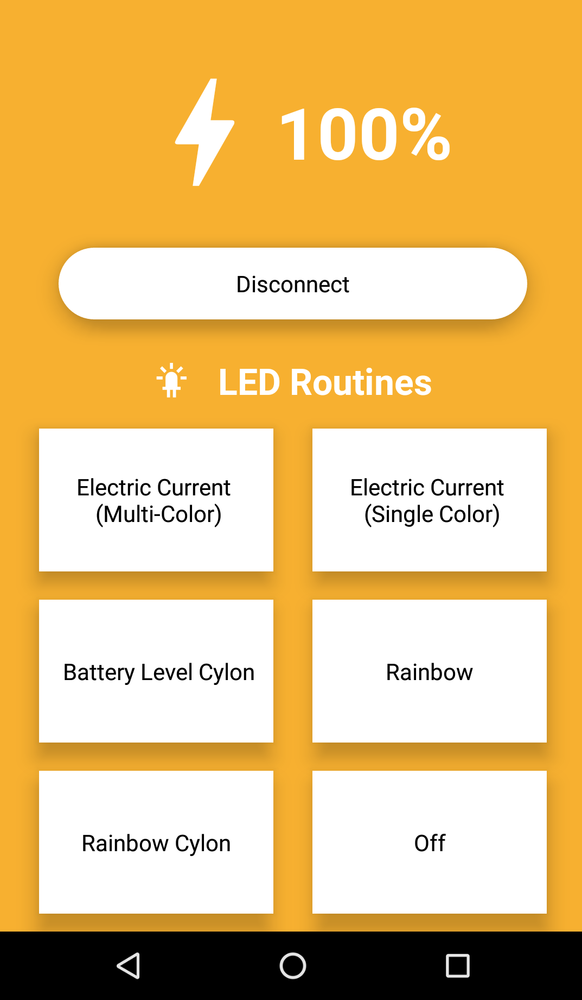

  

<h1 align="center">⚡ BLE Smart Charger</h1>

  The BLE Smart Charger is a custom-designed, 3D-printed wireless charger, capable of illustrating the current battery level of a connected IOS or Android device through the use of several pre-programmed, beautifully vibrant LED routines. 

## 🛠️ Materials

- [Arduino MKR WiFi 1010](https://store-usa.arduino.cc/products/arduino-mkr-wifi-1010)
- [Gikfun Qi Wireless Charger Coil and PCBA Motherboard](https://www.amazon.com/Gikfun-Wireless-Charger-Circuit-Charging/dp/B073W7P5T8/ref=sr_1_9?dchild=1&keywords=qi+wireless+charger+coil&qid=1631580272&s=electronics&sr=1-9)
- [WS2811 Programmable LED Strip](https://www.amazon.com/ALITOVE-Individual-Addressable-Programmable-Non-Waterproof/dp/B01MG49QKD/ref=sr_1_7?dchild=1&keywords=RGB+LED+WS2811+Strip&qid=1631580480&sr=8-7)
- 3D Printed Phone Charging Stand ( [Stand Blueprint]() ) ( [Cover Blueprint]() )

## 📖 How It Works

The charger and corresponding paired smartphone communicate with one another using Bluetooth Low Energy (BLE). In the Bluetooth specification, a peripheral device can be thought of as a server - it is responsible for advertising its available services and accepting incoming connections. For this project, the charger, specifically the Arduino MKR board housed in the charger stand, acts as the peripheral device. Conversely, the central device acts as a client - searching for available peripherals to connect to and initiating the connections.  The IOS or Android app running the companion React Native app acts as the central device in this instance.
 
### 🔋 Charger (Peripheral)
- Consists of the Arduino MKR board, 3D-printed stand, LED strip, and Qi charger.
- Acts as a connectable BLE peripheral / Generic Attribute Profile (GATT) Server.
- Defines and advertises a standard battery service along with two writable characteristics ( battery level and LED routine).
- Central can write to these characteristics to update or change them.
- LEDs are updated according to the value of the charachteristics.  

### 📱 IOS / Android  Device Running the Companion App (Central)
- Scans for and initiates a connection with nearby Bluetooth devices that  match the GATT service UUID defined by the peripheral. 
- Writes the current battery level of the smartphone to the peripheral’s battery level characteristic on a two minute interval.
- Uses user inputs to update the LED routine displayed by the charger by writing values to the LED routine characteristic. 

## 💻 Tech

The BLE Smart Charger uses a number of open source libraries to work properly:

- [React Native] - UI framework for creating native iOS and Android apps
- [react-native-ble-plx] - React Native Bluetooth Low Energy library
- [react-native-device-battery] - React Native library for observing devices battery level and charging status
- [react-native-background-timer] - React Native library for emitting events when app is in the background
- [Arduino BLE] - Library for Arduino boards with hardware enabled for BLE
- [FastLED] - LED animation library for Arduino
- [node.js] - Back-end JavaScript runtime environment 

## 📺  Demos

